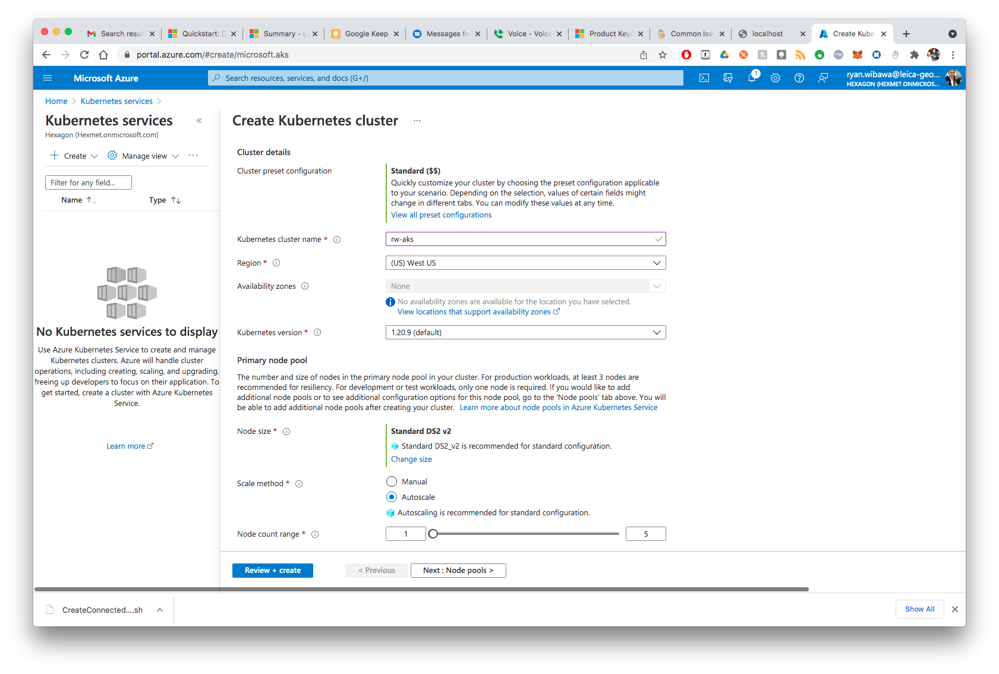
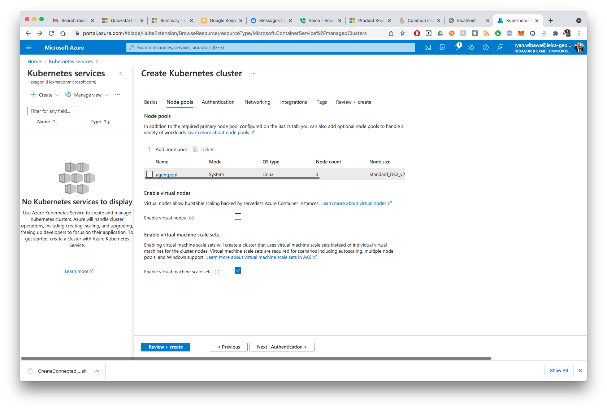
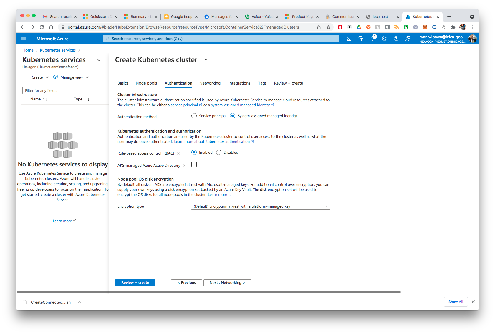
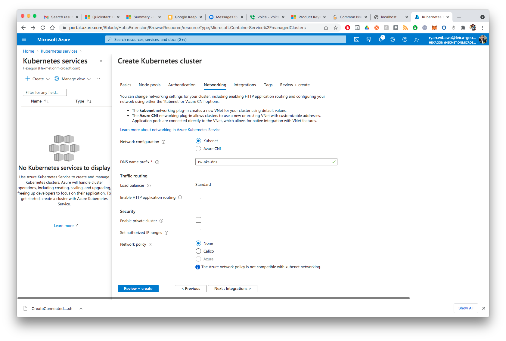
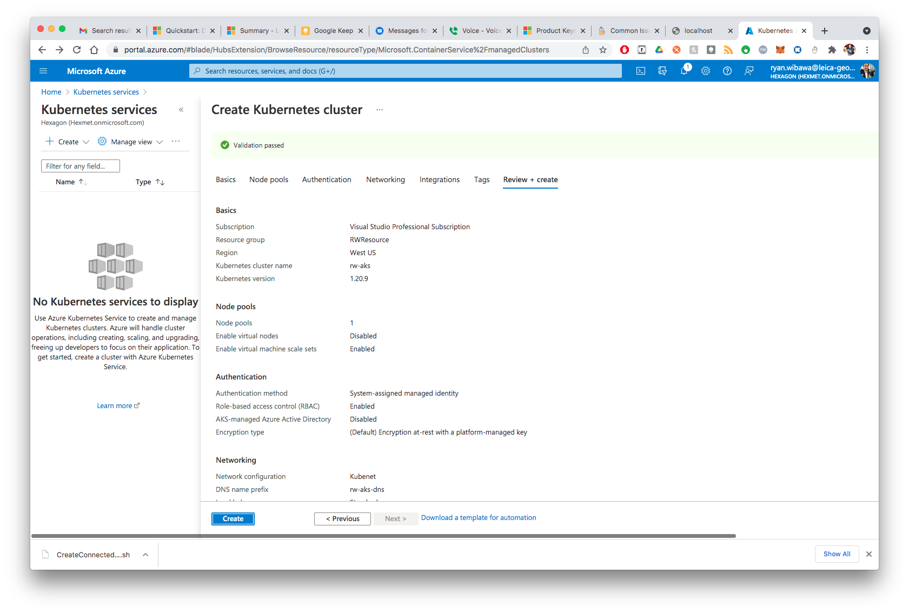
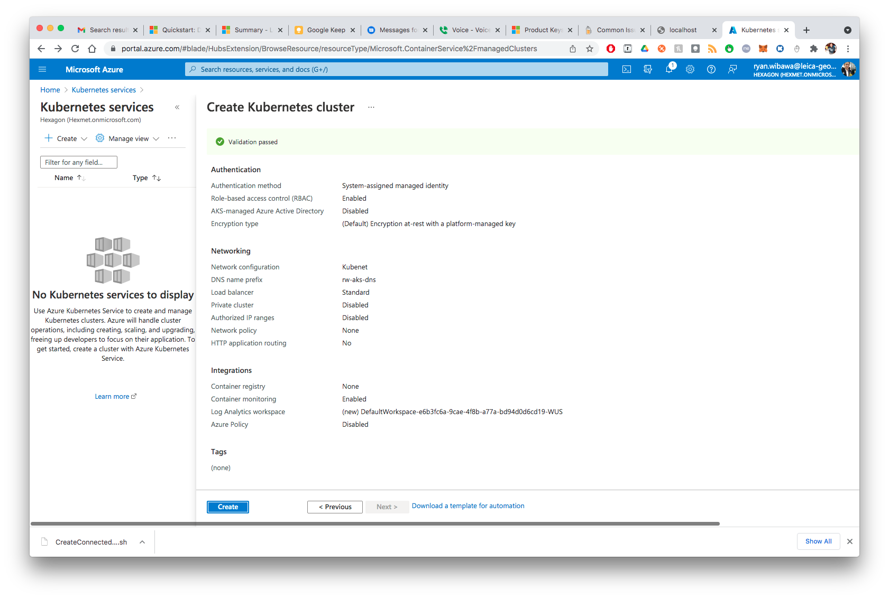
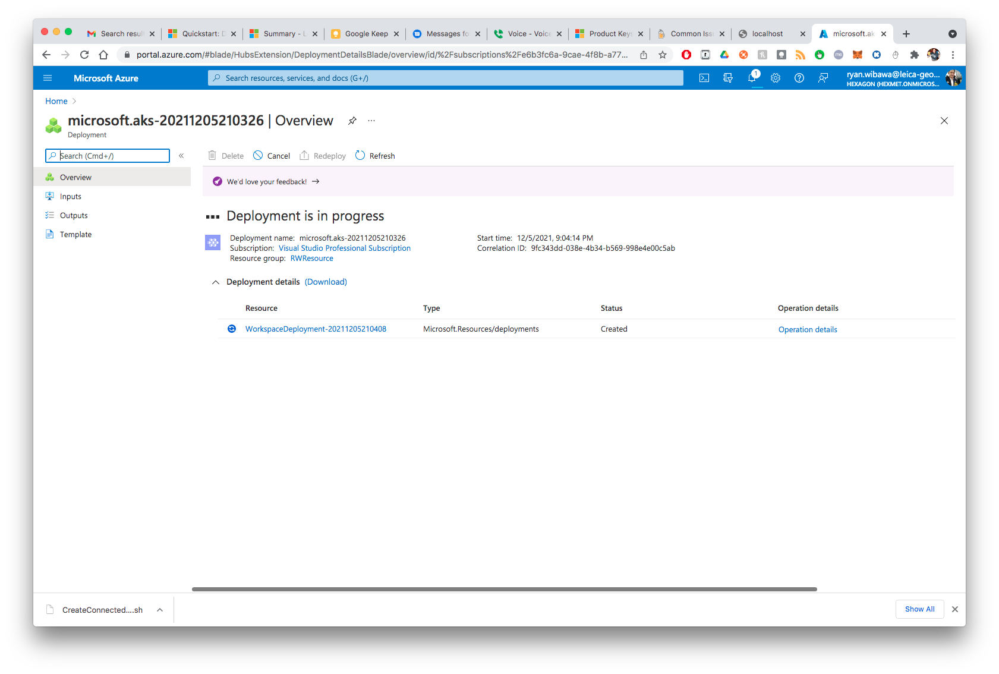
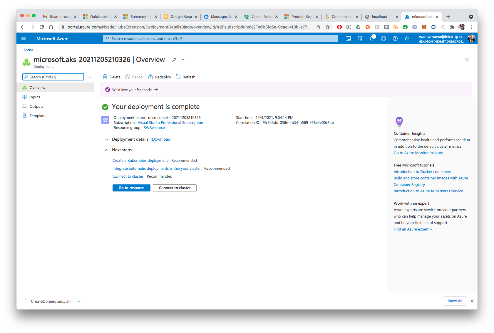
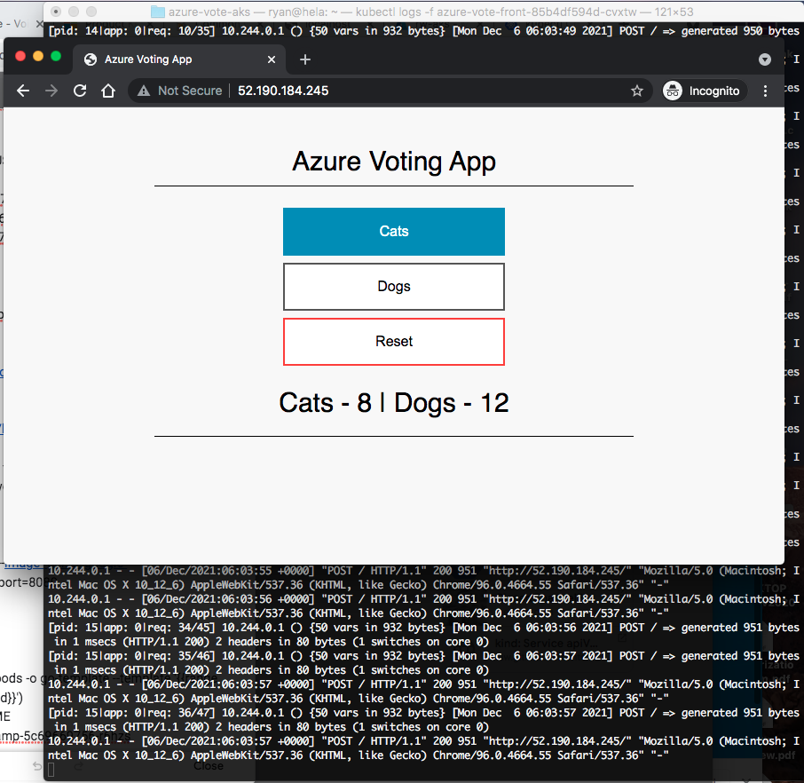

# azure-vote-aks
Azure AKS kubernetes cluster.
* [Tutorial](https://docs.microsoft.com/en-us/azure/aks/kubernetes-walkthrough-portal?WT.mc_id=APC-Kubernetesservices)

## 1. Create k8s cluster on Azure
* Set cluster name, region, and kubernetes version. Click `Next: Node pools`.

* Use default settings for the Node pools. Click `Next: Authentication`.

* Authentication. Click `Next: Networking`.
    - Authentication method: _System-assigned managed identity_
    - Role-based access control (RBAC): Enabled

* Networking (use default settings). Click `Review + create`.

* When _Validation passed_, click `Create`.


* Deployment in progress:

* Deployment is complete:


```sh
$ az account set --subscription e6b3fc6a-9cae-4f8b-a77a-bd94d0d6cd19
$ az aks get-credentials --resource-group RWResource --name rw-aks

$ alias kb=kubectl
$ kb config view
```

## 2. Deploy app to k8s cluster
```sh
$ vi azure-vote.yaml

$ alias kb=kubectl
$ kb apply -f azure-vote.yaml 
deployment.apps/azure-vote-back created
service/azure-vote-back created
deployment.apps/azure-vote-front created
service/azure-vote-front created

$ kubectl get service azure-vote-front --watch
NAME               TYPE           CLUSTER-IP     EXTERNAL-IP      PORT(S)        AGE
azure-vote-front   LoadBalancer   10.0.136.237   52.190.184.245   80:32203/TCP   53s

$ kb get pods
NAME                                READY   STATUS    RESTARTS   AGE
azure-vote-back-6c4dd64bdf-xl4cb    1/1     Running   0          21m
azure-vote-front-85b4df594d-cvxtw   1/1     Running   0          21m

$ kb exec -ti azure-vote-back-6c4dd64bdf-xl4cb bash
I have no name!@azure-vote-back-6c4dd64bdf-xl4cb:/$ pwd

$ kb get deploy
NAME               READY   UP-TO-DATE   AVAILABLE   AGE
azure-vote-back    1/1     1            1           5m41s
azure-vote-front   1/1     1            1           5m41s

$ kb logs -f azure-vote-front-85b4df594d-cvxtw
```

Azure Voting App:


## 3. Delete k8s Deployments
```sh
$ kb delete -f azure-vote.yaml
deployment.apps "azure-vote-back" deleted
service "azure-vote-back" deleted
deployment.apps "azure-vote-front" deleted
service "azure-vote-front" deleted
```
